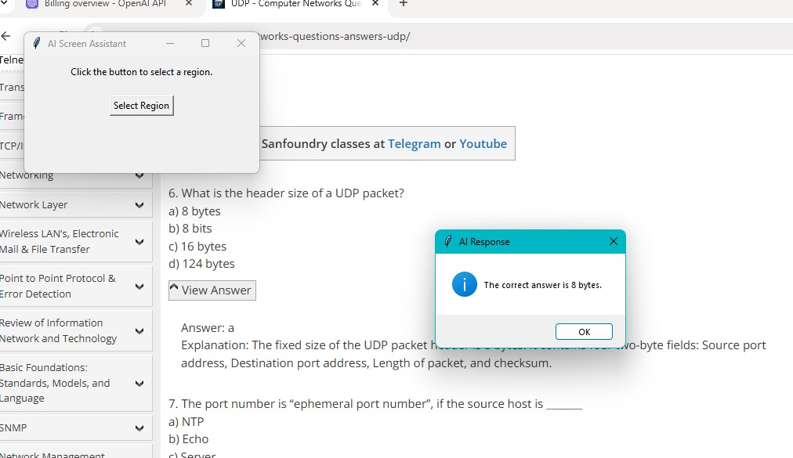

# AI Screen Assistant

This project is an AI-powered Screen Assistant that allows users to select a region on their screen, extract text from the selected region using OCR (Optical Character Recognition), and then process the extracted text with an AI model to generate a response. The AI processing is powered by the Cohere API.

---


## Features
- **Region Selection:** Enables users to select a portion of their screen interactively.
- **OCR Processing:** Extracts text from the selected region using Tesseract OCR.
- **AI Interaction:** Processes the extracted text with Cohere's AI model to generate meaningful responses.
- **User-Friendly GUI:** Simple and intuitive interface built with Tkinter.

---

## Requirements
- Python 3.10 or later
- Required libraries:
  - `tkinter`
  - `pyautogui`
  - `pytesseract`
  - `cohere`
  - `Pillow`

---

## Installation

1. Clone the repository:
   ```bash
   git clone https://github.com/your-username/ai-screen-assistant.git
   cd ai-screen-assistant
   ```

2. Install dependencies:
   ```bash
   pip install pyautogui pytesseract cohere pillow
   ```

3. Install Tesseract OCR:
   - Download and install Tesseract OCR from [Tesseract's official site](https://github.com/tesseract-ocr/tesseract).
   - Note the installation path and update the `pytesseract.pytesseract.tesseract_cmd` variable in the code.

4. Set up the Cohere API key:
   - Obtain an API key from [Cohere's official website](https://cohere.com/).
   - Add the key to your environment variables:
     ```bash
     set COHERE_API_KEY=your-cohere-api-key
     ```

---

## Usage

1. Run the application:
   ```bash
   python screen_assistant.py
   ```

2. Click the "Select Region" button in the GUI.
3. Select a region on your screen by clicking and dragging.
4. Wait for the OCR to process the selected region.
5. View the AI-generated response in a dialog box.

---

## File Structure
- `screen_assistant.py`: Main Python script containing the application code.
- `README.md`: Documentation file.

---

## Contributing
Contributions are welcome! Please open an issue or submit a pull request with your changes.

---

## License
This project is licensed under the MIT License. See the [LICENSE](LICENSE) file for details.

---

## Acknowledgements
- [Cohere](https://cohere.com/) for providing the AI API.
- [Tesseract OCR](https://github.com/tesseract-ocr/tesseract) for text extraction.
- [Tkinter](https://docs.python.org/3/library/tkinter.html) for the GUI framework.

